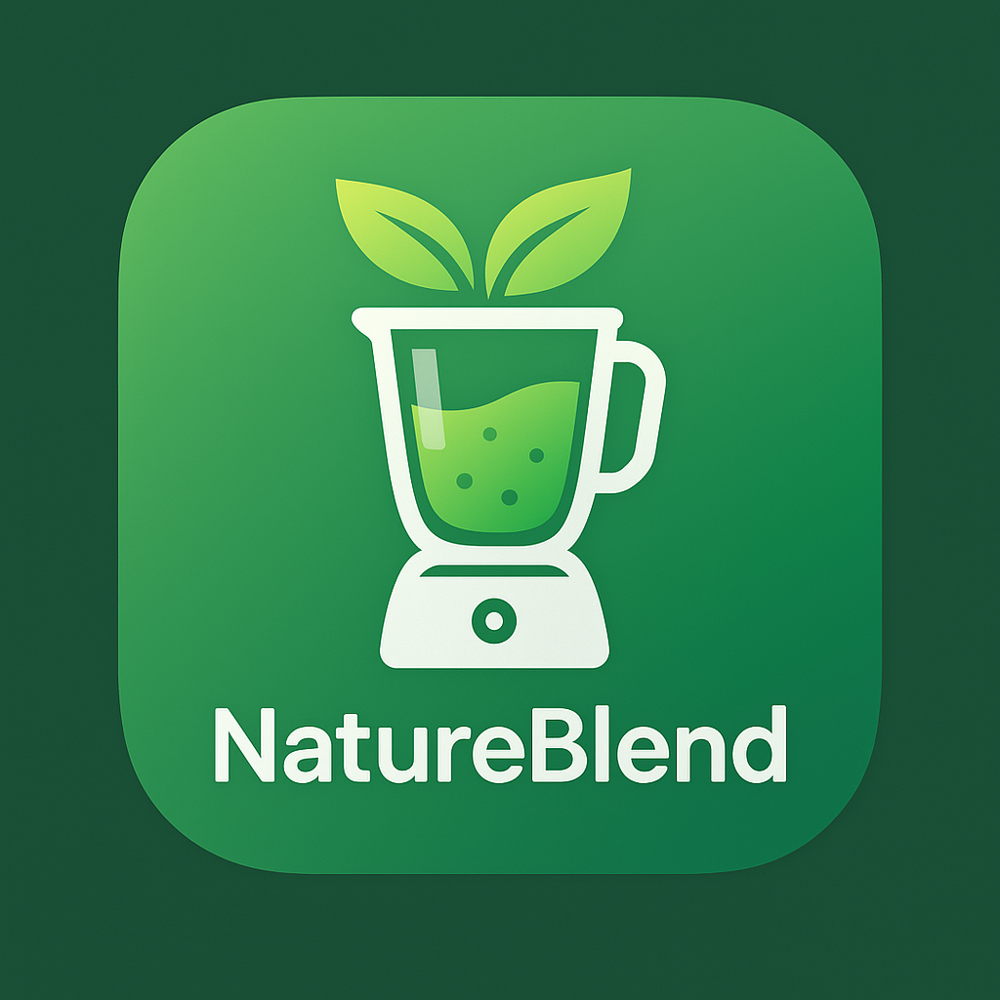

<div align="center">
  
  <h1>NatureBlend: Wellness Marketplace</h1>
  <p>🌿 Where Nature Meets Wellness 🌿</p>
  
  [](https://choosealicense.com/licenses/mit/)
  [](https://reactnative.dev/)
  [](https://expo.dev/)
  [](CONTRIBUTING.md)
  
</div>


<p align="center">
  <a href="#key-features">Features</a> •
  <a href="#demo--screenshots">Screenshots</a> •
  <a href="#getting-started">Getting Started</a> •
  <a href="#app-architecture">Architecture</a> •
  <a href="#tech-stack">Tech Stack</a> •
  <a href="#roadmap">Roadmap</a> •
  <a href="#connect-and-contribute">Contribute</a>
</p>

---

## 🌱 About the Project

NatureBlend is a dual-sided marketplace that connects conscious consumers with verified vendors of natural, sustainable wellness products and consultations, fostering a community dedicated to holistic well-being.

> "Bringing nature's healing power to your fingertips, ethically sourced and sustainably delivered."

## ✨ Key Features

### 🛒 Customer Experience
- **Personalized Dashboard** - Wellness tips and tailored product recommendations based on your preferences
- **Advanced Product Discovery** - Intuitive search and filters to find exactly what you need
- **Sustainability Metrics** - Track the environmental impact of each product you purchase
- **Seamless Shopping** - User-friendly cart management, checkout, and order tracking
- **User Profiles** - Save your preferences, favorites, and view order history

### 🏪 Vendor Experience
- **Business Dashboard** - Comprehensive analytics and inventory management tools
- **Product Management** - Easily add, edit, and manage your product listings
- **Order Processing** - Streamlined workflow for handling customer orders
- **Sales Analytics** - Data-driven insights to grow your business
- **Brand Customization** - Showcase your unique identity and sustainability practices

## 🎬 Demo & Screenshots

### Video Walkthrough
<p align="center">
  <a href="https://youtu.be/your-demo-link">
    
  </a>
</p>

### Screenshots

#### ✨ Customer App
<div align="center">
  <table>
    <tr>
      <td align="center"><b>Onboarding</b></td>
      <td align="center"><b>Product Browsing</b></td>
      <td align="center"><b>Product Details</b></td>
    </tr>
    <tr>
      <td></td>
      <td></td>
      <td></td>
    </tr>
    <tr>
      <td align="center"><b>Shopping Cart</b></td>
      <td align="center"><b>Checkout</b></td>
      <td align="center"><b>Order Tracking</b></td>
    </tr>
    <tr>
      <td></td>
      <td></td>
      <td></td>
    </tr>
  </table>
</div>

#### 🏪 Vendor App
<div align="center">
  <table>
    <tr>
      <td align="center"><b>Dashboard</b></td>
      <td align="center"><b>Product Management</b></td>
      <td align="center"><b>Order Management</b></td>
    </tr>
    <tr>
      <td></td>
      <td></td>
      <td></td>
    </tr>
  </table>
</div>

## 🏗 App Architecture

<details>
<summary>Click to expand architecture details</summary>

NatureBlend follows a modular architecture pattern with separate navigation stacks:

1. **🔐 Authentication Layer** - Shared login/signup system for both customer and vendor users
2. **👤 Role Selection** - Users choose between customer and vendor experiences
3. **🧭 Feature-specific Navigation** - Each role has its own dedicated bottom tab navigator
4. **🧩 Component Library** - Reusable UI components for consistent design language
5. **🔄 Mock Data Services** - Simulate backend interactions

For detailed architecture documentation, see [App Architecture](/docs/architecture.md).
</details>

## 🛠 Tech Stack

<div align="center">
  <table>
    <tr>
      <td align="center"><br>React Native</td>
      <td align="center"><br>Expo</td>
      <td align="center"><br>React Navigation</td>
      <td align="center"><br>React Native Elements</td>
    </tr>
  </table>
</div>

## 📂 Project Structure

<details>
<summary>Click to see the project structure</summary>

```
NatureBlend/
├── assets/                # Static assets (images, fonts)
├── src/                   # Source code
│   ├── components/        # Reusable UI components
│   │   ├── customer/      # Customer-specific components
│   │   └── vendor/        # Vendor-specific components
│   ├── constants/         # App constants, theme
│   ├── context/           # React context providers
│   ├── hooks/             # Custom React hooks
│   ├── navigation/        # Navigation configuration
│   ├── screens/           # App screens
│   │   ├── auth/          # Authentication screens
│   │   ├── customer/      # Customer app screens
│   │   └── vendor/        # Vendor app screens
│   ├── services/          # API services, data fetching
│   └── utils/             # Utility functions
└── App.js                 # App entry point
```
</details>

## 🚀 Getting Started

### Prerequisites

- Node.js (v14 or later)
- npm or yarn
- Expo CLI
- iOS Simulator / Android Emulator or physical device

### Installation

<details>
<summary>Click to view installation steps</summary>

1. Clone the repository
```bash
git clone https://github.com/yourusername/natureblend.git
cd natureblend
```

2. Install dependencies
```bash
npm install
# or
yarn install
```

3. Start the development server
```bash
npm start
# or
yarn start
```

4. Run on a device or simulator
```bash
# For iOS
npm run ios
# or yarn ios

# For Android
npm run android
# or yarn android
```
</details>

## 🎨 UI/UX Design

NatureBlend features a thoughtfully designed user interface with:

- **🎨 Color Palette**: Soft organic greens, earthy tones, and botanical highlights
- **🔤 Typography**: Clean, sustainable-feeling sans serif with organic serif accents
- **💡 Design Philosophy**: Simple, accessible, and nature-inspired interfaces
- **🤩 User Experience**: Intuitive navigation with minimal cognitive load

## 🌟 Implementation Features

<details>
<summary>Click to expand feature details</summary>

To meet the submission requirements, NatureBlend includes:

1. **🔐 Onboarding & Authentication**:
   - User type selection (Customer/Vendor)
   - Login/Signup with email
   - Password recovery

2. **🛒 Customer Experience**:
   - Product browsing with filters and categories
   - Detailed product views with sustainability metrics
   - Shopping cart management
   - Checkout process
   - Order placement and tracking
   - User profile management

3. **🏪 Vendor Experience**:
   - Business dashboard with key metrics
   - Product catalog management
   - Order processing workflow
   - Sales analytics
   - Store profile customization

4. **🔄 Shared Features**:
   - Wallet/Payment integration
   - Settings and preferences
   - Notifications center
</details>

## 📅 Development Roadmap

<div align="center">
  <table>
    <tr>
      <td align="center"><b>Phase 1</b> 🚀</td>
      <td align="center"><b>Phase 2</b> 🌱</td>
      <td align="center"><b>Phase 3</b> 🌿</td>
    </tr>
    <tr>
      <td>Core authentication and marketplace functionality</td>
      <td>Enhanced search, reviews, and analytics</td>
      <td>Community features and loyalty programs</td>
    </tr>
  </table>
</div>

## 🤝 Connect and Contribute

<p align="center">
  <a href="CONTRIBUTING.md">
    
  </a>
</p>

Contributions are what make the open-source community such an amazing place to learn, inspire, and create. Any contributions you make are **greatly appreciated**.

If you have a suggestion that would make this better, please fork the repo and create a pull request. You can also simply open an issue with the tag "enhancement".

## 📄 License

This project is licensed under the MIT License - see the [LICENSE](LICENSE) file for details.

## 👏 Acknowledgments

- Expo team for their excellent cross-platform framework
- The open-source community for inspiration and tools
- All contributors who have helped shape this project

---

<div align="center">
  <p>Made with 💚 by the NatureBlend Team</p>
  <p>
    <a href="https://github.com/yourusername">
      
    </a>
  </p>
</div>
